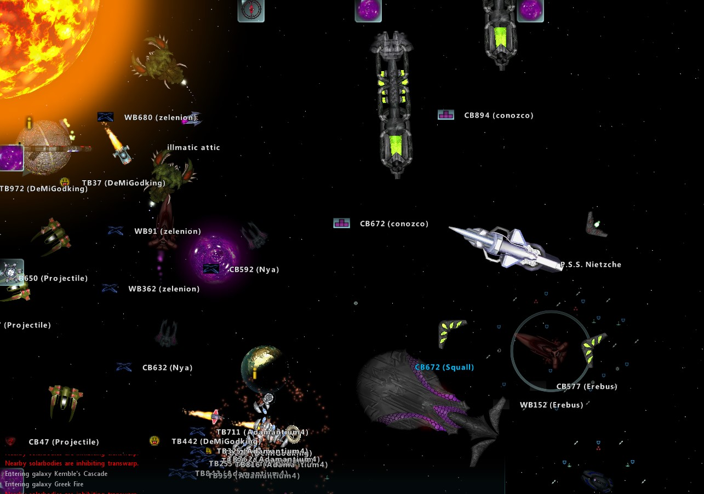
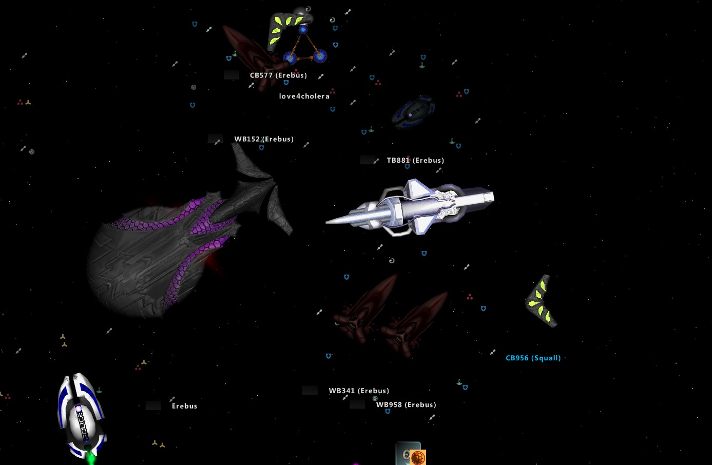
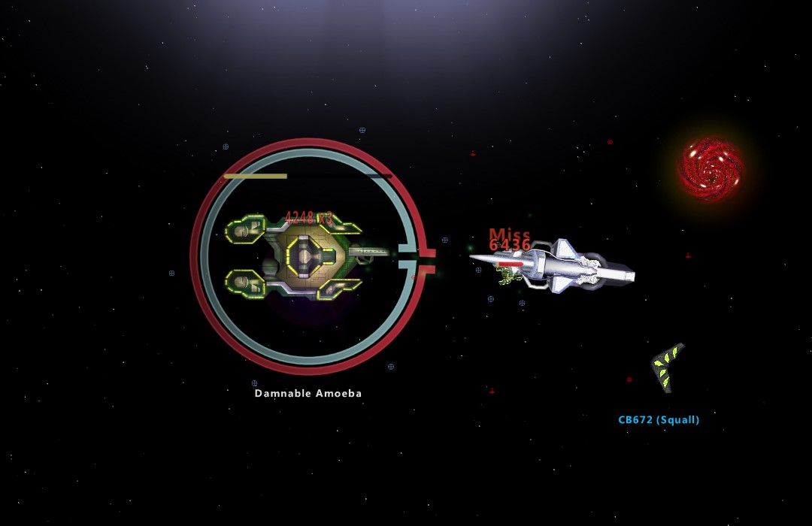
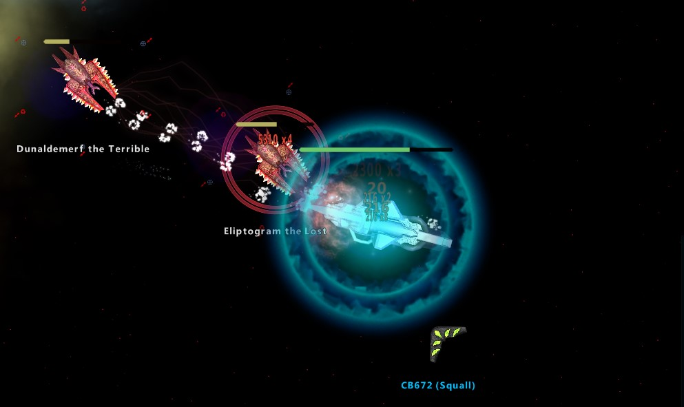

# ss-shaders

Custom Star Sonata 2 ship shaders which makes all ships to be illuminated from the top, which gives them "C1" / sprite feeling.

# Installation
Download [mod package](https://github.com/amorek/ss-shaders/releases/latest/download/spritelike-shaders.zip) into Star Sonata 2 "Content" directory.
To find the folder quickly type "%appdata%\Star Sonata 2\Content" into path window for standalone game, or in Steam version right click on Star Sonata 2 in library > Manage > Browse local files

Shaders only work on Medium, High and Very High graphic settings. Game does not use shaders in rendering on Low settings.

# Screenshots

